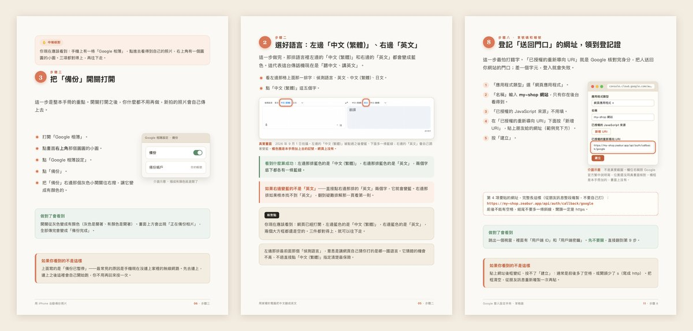
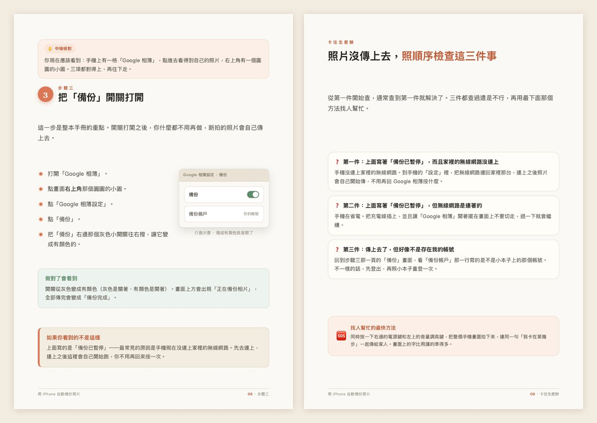
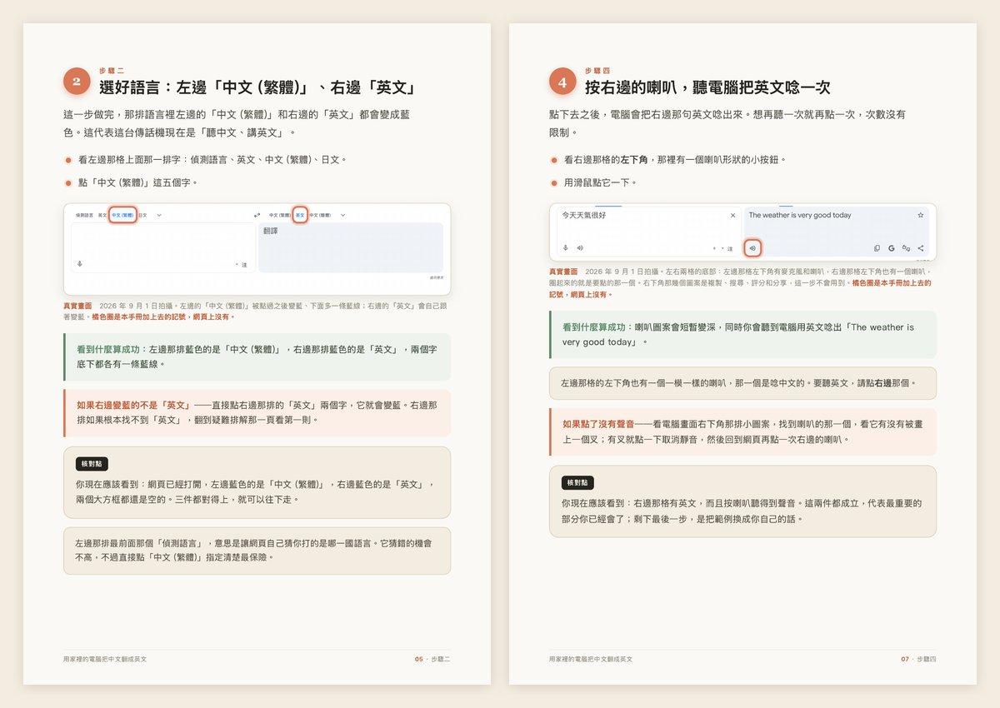
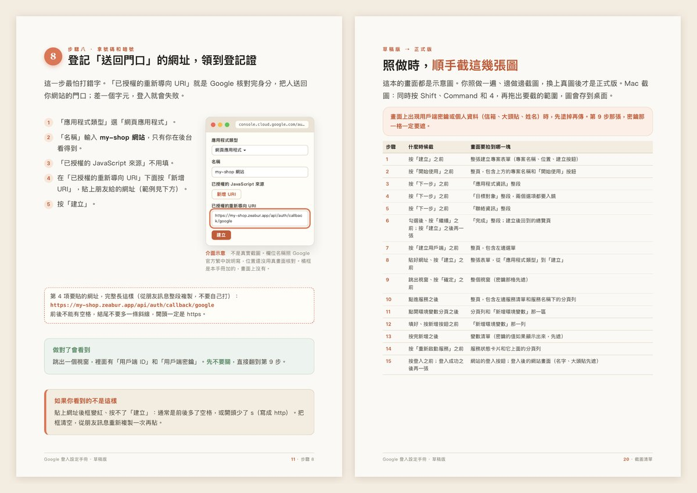

<div align="center">

# newbie-handbook

**Turn a technical process into a step-by-step A4 PDF that someone with zero tech background can follow alone.**
**把一段技術流程，翻成完全不懂技術的人也能自己照著做的 A4 圖文手冊。**

A Claude Code skill that asks three questions before writing, keeps every step to one action, and checks each page before it hands over the PDF.
一個 Claude Code skill：動筆前先問三題，每一步只做一個動作，逐頁看過才交出 PDF。

[](#license)


**[English](#english)** · **[繁體中文](#繁體中文)**



<sub>Step pages from three real runs: iPhone photo backup · Google Translate on the web · Sign in with Google (draft)</sub><br>
<sub>三次實跑的步驟頁：iPhone 照片自動備份 · Google 翻譯網頁版 · 網站接 Google 登入（草稿版）</sub>

</div>

---

<a name="english"></a>

## English

I took a course at ALPHA Camp, and the part that stayed with me was the notes: every step was cut so small that following along had almost no friction. I wanted that same feel whenever I ask AI to write a tutorial for someone who isn't technical. This skill is my attempt at a translator between people who don't know tech and the AI or tech stack behind the task.

AI-written tutorials tend to break in two places:

1. **Nobody asked the right questions first.** Scope, difficulty and format drift, and the whole thing gets rewritten no matter how nicely it reads.
2. **It reads like AI wrote it.** A big opening about the times we live in, a cheer after every step, a generic send-off at the end, and the reader still can't tell whether they did it right.

### A typical AI tutorial vs. newbie-handbook

| | Typical AI tutorial | newbie-handbook |
|---|---|---|
| Before writing | Starts right away and guesses who the reader is | Asks three questions (what to teach, who reads it, what it's for), then **stops and waits**. Skips them only when your first message already answers all three |
| Step size | "Set up your account" counts as one step | One action per step. Everything on the same screen or form, closed by one Next or Create, counts as one step; at most 5 sub-actions |
| What each step says | What to do | What to do → where to do it → what you'll see when it worked |
| When the reader gets stuck | Not covered | Every step has an "if you see something else" exit. When the only exit left is "ask someone", it also says what the reader can do while waiting for a reply |
| Tone | Hype, cheering, vague hedges | 24 banned patterns, each with a bad and a good example, plus a whitelist so step numbers and short commands don't get flagged |
| Screenshots | Invented, or none | Four-tier order: your screenshots > Playwright captures of public pages > official doc images (credited) > CSS mockups (labelled as mockups) |
| Dashboards behind a login | Mockups passed off as the real thing | First version ships as a **draft** with a shot list. It becomes final only after someone follows it with a real account and real screenshots replace the mockups |

### What you get

An A4 portrait PDF in cream and orange, plus the HTML source you can edit, rendered with Playwright and checked page by page. The handbook stays neutral: no author name, social accounts, QR codes, clickable links or marketing. URLs the reader has to paste or compare (a sign-in callback URL, for example) are printed as plain text, never as clickable links.

Step images follow the four-tier order: your screenshots > Playwright captures of public pages > official doc images (credited) > CSS mockups (labelled honestly). The skill won't log in on your behalf to capture pages behind a login, and Playwright can't capture native phone app screens. In both cases it falls back to screenshots you provide or a CSS mockup, and labels which one it used.

For dashboards that need a login, the first version is a **draft** built from mockups, with a shot list of which screenshots to take while following it. Someone follows it with a real account and sends the screenshots back; once the real screenshots are in, it's marked final.

The troubleshooting page always includes one entry for "no error message, it just doesn't respond."

One pair from the banned list (`references/deai-teaching.md`, rule 5, "don't cheer the reader on mid-way"):

> ❌ 太棒了！你已經完成第一步，做得非常好！接下來是第二步，別擔心，你一定可以的！
> *(Great job! You finished step one! On to step two, don't worry, you've got this!)*
>
> ✅ 存好之後，畫面右上角會出現一個綠色的勾，代表帳號已經連上。
> *(Once it's saved, a green check shows up in the top-right corner. That means the account is connected.)*

### The workflow

```
1  Grilling        Ask 3 questions, stop, wait for answers, restate to confirm
2  Details         OS, output folder, existing screenshots, outside requirements
3  Fact-check      Official docs for versions, URLs, commands and exact button labels
4  Build           Copy assets/template.html and render.mjs into a project folder
5  Fill pages      Cover → overview → prep → one page per step → troubleshooting → wrap-up
6  Render          render.mjs → A4 PDF + one QA image per page
7  Page-by-page QA Look at every page, run the friction check and the de-AI pass, fix, re-render
8  Deliver         Delete QA images, say which images are real and which are mockups
```

### See it in action: three real runs

#### 1. Teaching a 60-year-old mom to back up iPhone photos to Google Photos

<a href="examples/iphone-photo-backup-handbook.pdf"></a>

- Three questions came first. The answers (role-played for this test) pushed the handbook to start from downloading the app, gave it 4 steps, and added a page of "check these three things in order."
- It was going to be printed, so body text went from 13.5px to 16px.
- An independent reviewer flagged a status message that isn't Google's official wording. Tracing it turned up 3 spots with made-up status text (2 different wordings). All 3 now use the label from Google's Traditional Chinese help page.
- 9 pages. PDF and HTML source: [`examples/`](examples/)

#### 2. Teaching a dad who has never searched on a computer to use Google Translate on the web

<a href="examples/google-translate-handbook.pdf"></a>

- The three questions were skipped on purpose: the one-sentence request already covered what, who (including the device) and why, so the skip rule applied.
- All 7 image slots are Playwright captures of the live page. Zero mockups.
- The screenshots caught something nobody would write from memory: after you click Chinese on the left, the right side switches to English by itself. That became step 2's success check, and the handbook went from 6 steps to 5.
- 10 pages. PDF: [`examples/google-translate-handbook.pdf`](examples/google-translate-handbook.pdf)

#### 3. Adding "Sign in with Google" to a site on Zeabur: three rounds of newbie testing



Each round, one agent made the handbook and a fresh agent played the newbie. It only got the finished handbook and, for every step, had to answer: where do I click, what am I missing, how do I know it worked, what if my screen looks different. The problems each round found were written back into the skill rules.

| | Round 1 | Round 2 | Round 3 |
|---|---|---|---|
| Could the PDF be produced? | No. The render script couldn't find a browser | Yes, 21 pages, with the unpatched script | Yes, 21 pages |
| Button labels | Copied from English docs, didn't match a Chinese interface | About 30 of 47 backed by official Traditional Chinese pages (about 64%) | 45 of 47 (96%), after correcting 2 misjudged "not found" rows |
| Steps where the newbie was completely stuck | 0, but that round only compared the PDF with itself | 3 | 0 |
| Step images that are mockups | 12 of 15 | 13 of 16 | 15 of 15 |
| Problems written back into the skill | 7 | 9 | 9 |

**What's still unsolved:** both dashboards need a login, and the skill won't log in on your behalf. So every step image in round 3 is a mockup, and the handbook is labelled a draft. Whether the mockups match the real screens is something only a real person with a real account can find out. That run hasn't happened yet.

### Install

You need Claude Code, or any runtime that supports Agent Skills. Get this repo:

```bash
git clone https://github.com/DennisWei9898/newbie-handbook.git
```

If you'd rather not use git, download the ZIP from the GitHub page and unzip it.

Copy the skill folder into your skills directory:

```bash
mkdir -p ~/.claude/skills
cp -R newbie-handbook/skills/newbie-handbook ~/.claude/skills/
ls ~/.claude/skills/newbie-handbook
```

The last command should list `SKILL.md`, `assets` and `references`. **Copy `references/` too.** The core rules live there, and without it the skill stops and asks you to check the folder.

Rendering the PDF needs Playwright. If you don't have it yet:

```bash
npm install -g playwright
npx playwright install chromium
```

If Playwright's own browser is missing (common after a Playwright update), `render.mjs` falls back to Google Chrome on your computer. If neither starts, it prints a plain-language note on what happened and what to try.

### Usage

Describe the handbook you want in plain words:

> Make a handbook that teaches a coworker who's new to computers how to sync our shared company folder to their laptop.

What happens next:

1. **It asks three questions** (what to teach, who reads it, what it's for) and waits. It won't start writing until you answer, unless your request already covered all three.
2. It restates what it understood so you can catch a misunderstanding early.
3. It checks official docs for commands, URLs and button labels.
4. It copies `assets/template.html` into a project folder as `index.html` and fills it page by page.
5. It renders the PDF and a QA image for every page:

```bash
node render.mjs index.html "安裝手冊.pdf"
```

6. It looks at every QA image, fixes layout and wording, deletes the QA images, and hands over the PDF and HTML source.

The handbooks themselves are written in Traditional Chinese (Taiwan). The rules are in Traditional Chinese too; Claude follows them whatever language you use to ask.

### What's in the repo

```
newbie-handbook/
├── README.md
├── LICENSE
├── docs/                           README images, rendered from real handbook pages
├── examples/
│   ├── iphone-photo-backup-handbook.html
│   ├── iphone-photo-backup-handbook.pdf
│   └── google-translate-handbook.pdf
└── skills/
    └── newbie-handbook/
        ├── SKILL.md                Entry point: role, hard rules, workflow
        ├── references/
        │   ├── grilling.md         The three questions, restating, skip rules, follow-ups, outside requirements, per-platform UI language, skip version questions that don't change the steps
        │   ├── writing-eli5-cba.md Conclusion first, plain-language terms, everyday analogies, self-checks, what to write when the official docs don't say
        │   ├── microsteps.md       14 step-size rules, what counts as one step, exits when the only option is asking someone
        │   ├── deai-teaching.md    24 banned patterns, false-positive whitelist, when hedges may stay, self-test for scan scripts
        │   └── real-screenshots.md Four-tier image sources, Playwright captures, markings, four boundaries, login-wall draft flow, side-by-side Chinese/English labels, machine-translated pages and verbatim checks, on-screen text height, site-wide search before "not found", unverified positions
        └── assets/
            ├── template.html       A4 page skeleton, design tokens and step-page components
            └── render.mjs          HTML → A4 PDF + per-page QA images, falls back to Chrome
```

### When *not* to use it

- Plain-text SOPs with no screens to show.
- Docs written for engineers.
- Slide decks.

For a small follow-up on a handbook you already made (add a step, switch to a different version), the skill skips the three questions by itself.

### Related

- [fable-commander](https://github.com/DennisWei9898/fable-commander): the plan → research → maker/verifier workflow this skill's upgrade was run with.
- [loop-engineering-reviewer](https://github.com/DennisWei9898/loop-engineering-reviewer): audits an agent or skill loop for maker/verifier separation.

### Credit

- The de-AI rules adapt ideas from [speak-human-tw](https://github.com/Raymondhou0917/speak-human-tw) and [sepia](https://github.com/Nanako0129/sepia), narrowed down to step-by-step tutorials.
- The idea of cutting steps very small comes from my time at ALPHA Camp.

### License

MIT. See [`LICENSE`](LICENSE).

---

<a name="繁體中文"></a>

## 繁體中文

我上 ALPHA Camp 的課時，最有感的是筆記：每個 step 都拆得很小，照著做幾乎不會卡。之後請 AI 幫不懂技術的人寫教學，我也想要同樣的感覺。所以做了這個 skill，讓它當不懂技術的人和 AI、技術架構之間的翻譯橋樑。

請 AI 寫教學文件，最常壞在兩個地方：

1. **一開始就沒問對問題。** 範圍、難度、格式都偏掉，寫得再漂亮也要重做。
2. **讀起來就是 AI 寫的。** 開場先戴一頂時代大帽子，每一步喊一次加油，結尾一句萬用祝福，讀者看完還是不知道自己有沒有做對。

### 一般 AI 寫的教學 vs newbie-handbook

| | 一般 AI 寫的教學 | newbie-handbook |
|---|---|---|
| 動筆前 | 直接開寫，讀者是誰靠猜 | 先問三題（教什麼、給誰、拿去幹嘛），然後**停下來等你回答**。你第一句話就講齊三件事，才會跳過 |
| 一步多大 | 「設定好你的帳號」算一步 | 一步一動作（同一段表單、用一次「下一步」或「建立」收尾的算一步），子動作最多 5 項 |
| 每步寫什麼 | 做什麼 | 做什麼 → 在哪做 → 看到什麼算成功 |
| 讀者卡住時 | 沒寫 | 每一步都有「如果你看到的不是這樣」的出口；出口只剩「找人問」時也要寫等回覆期間可以先做什麼 |
| 語氣 | 誇大、喊加油、模糊的限定詞 | 24 條禁用規則，每條附一組正反例；另有白名單，步驟編號、簡短指令句不會被誤判 |
| 畫面 | 自己編，或乾脆沒有 | 照四層優先序挑：你給的真圖 > Playwright 實拍公開網頁 > 官方文件圖（標出處）> CSS 介面示意（標明是示意） |
| 要登入的後台 | 把示意圖當成真畫面 | 第一版標**草稿版**，附一份「照做時要截哪幾張圖」的清單；有人拿真帳號照做、換上真圖，才改標正式版 |

### 成品長什麼樣

成品是米白＋橘色調的 A4 直式 PDF，另附可以修改的 HTML 原稿，經 Playwright 渲染並逐頁校稿。成品保持中立：不放署名、社群帳號、QR code、可點連結或行銷導流。讀者要照著貼上或比對的網址（例如登入設定用的回呼網址）會用純文字印出來，但不做成可點的連結。

步驟圖照四層優先序挑：使用者提供真圖 > Playwright 實拍公開網頁 > 官方文件圖（標註出處）> CSS 介面示意（誠實標示）。登入牆後面的頁面它不會代你登入去拍，手機 App 的原生畫面 Playwright 也拍不到，這兩種情況退回你自己提供的截圖或介面示意，並照實標示是哪一種。

要登入才看得到的後台，第一版會先用介面示意做成「草稿版」，同時附一份「照做時要截哪幾張圖」的清單。你拿真帳號照做一遍、把截圖傳回來，換成真圖之後才標成正式版。

疑難排解頁固定包含一條「沒有錯誤訊息、只是沒反應」。

去 AI 味清單裡的一組正反例（出自 `references/deai-teaching.md` 第 5 條「中途不要喊加油」）：

> ❌ 太棒了！你已經完成第一步，做得非常好！接下來是第二步，別擔心，你一定可以的！
>
> ✅ 存好之後，畫面右上角會出現一個綠色的勾，代表帳號已經連上。

### 流程總覽

```
1  Grilling     問三題、停下來等回答、複述確認
2  細節釐清      作業系統、輸出位置、有沒有現成截圖、要先準備的外部條件
3  查官方        版本、網址、指令、按鈕上真正印的字
4  建專案        把 assets/template.html 與 render.mjs 複製到專案資料夾
5  填內容        封面 → 總覽 → 事前準備 → 每步一頁 → 疑難排解 → 結尾
6  渲染          render.mjs → A4 PDF ＋ 每頁一張 QA 截圖
7  逐頁校稿      每頁都看，跑摩擦力自檢與去 AI 味三輪掃，改完重渲染
8  交付          刪掉 QA 截圖，講清楚哪些是真圖、哪些是示意
```

### 實際長什麼樣：三個真的跑過的案例

#### 1. 教 60 歲的媽媽用 iPhone 自動備份照片到 Google 相簿

<a href="examples/iphone-photo-backup-handbook.pdf"></a>

- 先問三題才動筆（這次的回答由測試流程模擬）。回答決定了手冊從下載 App 開始教、全部 4 步，另外多一頁「照順序檢查這三件事」。
- 手冊要印出來看，內文從 13.5px 調到 16px。
- 獨立驗收時發現一個狀態文字不是 Google 官方的寫法，順著查下去，自己編的狀態字樣共 3 處（2 種寫法），全部改成 Google 繁中說明頁上的字。
- 共 9 頁。PDF 與 HTML 原稿在 [`examples/`](examples/)

#### 2. 教沒用電腦查過東西的爸爸，用 Google 翻譯網頁版

<a href="examples/google-translate-handbook.pdf"></a>

- 這次刻意跳過三題，因為使用者一句話就講齊教什麼、給誰（連用哪種電腦都講了）、拿去幹嘛，符合跳過判準。
- 7 處圖片都是 Playwright 拍的真實網頁，示意圖 0 張。
- 實拍抓到憑記憶寫不出來的事：左邊點了中文之後，右邊會自己跳成英文。這件事寫成步驟二的成功畫面，手冊也從 6 步變成 5 步。
- 共 10 頁。PDF：[`examples/google-translate-handbook.pdf`](examples/google-translate-handbook.pdf)

#### 3. 幫架在 Zeabur 上的網站接上 Google 登入：扮新手連測三次


每一次都由一個 agent 做手冊，另一個全新的 agent 扮新手。扮新手的只拿得到做好的手冊，每一步都要答出四件事：點哪裡、缺什麼、怎麼知道成功、畫面不一樣怎麼辦。每一次找到的問題都寫回 skill 條文。

| | 第一次 | 第二次 | 第三次 |
|---|---|---|---|
| PDF 產得出來嗎 | 產不出來，渲染腳本找不到瀏覽器 | 產得出來，原版腳本不加補丁產出 21 頁 | 產得出來，21 頁 |
| 按鈕字樣 | 照英文官方文件寫，對不上中文介面 | 47 個裡約 30 個有官方繁中佐證（約六成四） | 47 個裡 45 個（96%，更正了對照時 2 個判錯的「查無」） |
| 扮新手判定「完全卡死」 | 0 個，但這一次只拿手冊對手冊，測不出圖跟真畫面對不上 | 3 個 | 0 個 |
| 步驟圖是示意圖的 | 15 步裡 12 張 | 16 步裡 13 張 | 15 步全部 |
| 寫回 skill 的問題 | 7 項 | 9 項 | 9 項 |

**還沒解決的：** 兩個後台都要登入才看得到，skill 不會代替你登入去拍。所以第三次的步驟圖全部是示意圖，手冊標的是草稿版。示意圖跟真實畫面對不對得上，要有真人拿真帳號照做一遍才知道，這一步還沒做。

### 安裝

需要 Claude Code（或任何支援 Agent Skills 的執行環境）。先取得這個 repo：

```bash
git clone https://github.com/DennisWei9898/newbie-handbook.git
```

不想用 git 的話，直接從 GitHub 頁面下載 ZIP 解壓縮也一樣。

把 skill 資料夾整包複製到你的 skills 目錄：

```bash
mkdir -p ~/.claude/skills
cp -R newbie-handbook/skills/newbie-handbook ~/.claude/skills/
ls ~/.claude/skills/newbie-handbook
```

最後那行應該列出 `SKILL.md`、`assets`、`references` 三項。**`references/` 一定要跟著複製**，核心規則都在裡面，少了它 skill 會停下來要你確認資料夾有沒有複製完整。

渲染 PDF 需要 Playwright。還沒裝過的話：

```bash
npm install -g playwright
npx playwright install chromium
```

產 PDF 時如果找不到 Playwright 自帶的瀏覽器（Playwright 更新過之後常見），`render.mjs` 會自動改用電腦上的 Google Chrome。兩個都開不起來，它會印一段白話說明，告訴你發生什麼事、可以怎麼做。

### 用法

裝好之後，直接用自然語言描述你要的手冊就會觸發，例如：

> 幫我做一份手冊，教完全不會用電腦的同事把公司的共用資料夾同步到他的筆電。

接下來會發生的事：

1. **它會先問你三題**（教什麼、給誰、拿去幹嘛），然後停下來等你回答。你沒回答它不會開始寫；你一句話已經把三件事講齊，它才會跳過。
2. 收到回答後複述一次它的理解，確認沒有會錯意。
3. 查官方文件核對指令、網址與按鈕名稱。
4. 把 `assets/template.html` 複製到專案資料夾當 `index.html`，逐頁填內容。
5. 渲染成 PDF，同時輸出逐頁 QA 截圖：

```bash
node render.mjs index.html "安裝手冊.pdf"
```

6. 逐頁看過 QA 截圖檢查跑版與內容，修好之後刪掉截圖，交付 PDF 與 HTML 原稿。

### 目錄結構

```
newbie-handbook/
├── README.md
├── LICENSE
├── docs/                           README 用圖，從實際產出的手冊頁面渲染
├── examples/
│   ├── iphone-photo-backup-handbook.html
│   ├── iphone-photo-backup-handbook.pdf
│   └── google-translate-handbook.pdf
└── skills/
    └── newbie-handbook/
        ├── SKILL.md                入口：定位、鐵律、工作流程
        ├── references/
        │   ├── grilling.md         前置提問三題、複述鎖定、跳過判準、追問樹、外部條件檢查、各平台介面語言、版本不影響時不追問
        │   ├── writing-eli5-cba.md 結論先行、白話翻譯、生活化比喻、三輪自檢、官方沒寫清楚時的寫法
        │   ├── microsteps.md       微步驟粒度 14 條、一步怎麼算、找人求助時的出口寫法
        │   ├── deai-teaching.md    去 AI 味禁用清單 24 條、假陽性白名單、無法確認時保留限定詞的條件、機器閘自測
        │   └── real-screenshots.md 畫面來源四層優先序、Playwright 實拍、圖上標記、四條邊界、登入後台兩階段、中英並列字樣、機器翻譯頁與逐字查核、截圖字高算法、站內全文搜尋、位置待核對
        └── assets/
            ├── template.html       A4 頁面骨架、設計系統與步驟頁元件
            └── render.mjs          HTML → A4 PDF ＋ 逐頁 QA 截圖，找不到瀏覽器時改用 Chrome
```

### 什麼時候不該用

- 純文字 SOP，沒有畫面要給人對照。
- 給工程師看的文件。
- 投影片簡報。

如果只是替做好的手冊加一步、改成另一個版本，skill 自己會跳過三題，不用特別交代。

### 姊妹作

- [fable-commander](https://github.com/DennisWei9898/fable-commander)：這個 skill 升級時用的工作流，規劃 → 研究 → maker／verifier 分離執行。
- [loop-engineering-reviewer](https://github.com/DennisWei9898/loop-engineering-reviewer)：體檢 agent 或 skill 迴圈有沒有把「寫的人」和「查的人」分開。

### 致謝

- 去 AI 味規則參考了 [speak-human-tw](https://github.com/Raymondhou0917/speak-human-tw) 與 [sepia](https://github.com/Nanako0129/sepia) 的做法，再收斂成只管一步一步教學手冊的版本。
- 步驟拆到很小的想法，來自我上 ALPHA Camp 的經驗。

### 授權

MIT，見 [`LICENSE`](LICENSE)。
